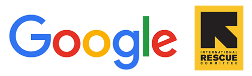

## Description

This survey was hosted on [Qualtrics](https://www.qualtrics.com) and participants were randomly sorted into one of eight variations (see [Design](design.html)).

Participants were recruited through [Amazon Mechanical Turk](https://www.mturk.com/mturk/welcome) and were paid \$0.75 for their response, which is equivalent to a \$9/hour wage:

```{r calculate-payment}
hourly.wage <- 9
survey.length.minutes <- 5

payment <- survey.length.minutes * (hourly.wage / 60)
payment
```

## Survey experiment {.survey}

### Consent 

***Q1.1***: Consent form here…

*Q1.2*: I have read the above information, and I consent to take part in the study.

:   Single answer

    - Yes
    - No

---

### Crackdown and private giving

{.img-responsive .center}

\

***Q2.1***: The **International Rescue Committee** (IRC) focuses on {ISSUE AREA: humanitarian assistance for refugees | human rights for refugees} {MAIN MANIPULATION: and works in countries that have recently passed laws that harshly restrict nonprofit organizations}.
 
A substantial proportion of IRC’s funding comes from {FUNDING SOURCE: government | private donors}.

*Q2.2*: How likely would you be to donate to IRC?

:   Single answer

    - Extremely likely
    - Somewhat likely
    - Neither likely nor unlikely
    - Somewhat unlikely
    - Extremely unlikely

*Q2.3*: If you had an extra $100, how much would you be willing to donate to IRC right now? (*Total must add to 100*)

:   Numeric slider, options must sum to 100

    - Donate to IRC (0–100)
    - Keep for yourself (0–100)
 	 	 	 		
*Q2.4*: Why would you donate that amount?

:   Text field

---

### Crackdown and corporate social responsibility (CSR)

{.img-responsive .center}

\

***Q3.1***: In December 2016, Google held a Giving Weekend and raised $X and did YYY to support International Rescue Committee’s (IRC) efforts in {ISSUE AREA: providing humanitarian assistance for refugees | advocating human rights for refugees} {in countries where nonprofit organizations are harshly restricted}. 
 
A substantial proportion of IRC’s funding comes from {FUNDING SOURCE: government | private donors}.

*Q3.2*: How favorable do you feel towards Google?

:   Single answer

    - Extremely positive
    - Somewhat positive
    - Neither positive nor negative
    - Somewhat negative
    - Extremely negative

*Q3.3*: How generous do you feel Google is?

:   Single answer

    - Extremely generous
    - Very generous
    - Moderately generous
    - Slightly generous
    - Not generous at all

*Q3.4*: Rate how strongly you feel Google is committed to philanthropy:

:   Single answer

    - Extremely committed
    - Very committed
    - Moderately committed
    - Slightly committed
    - Not committed at all

*Q3.5*: Where would you most like to see Google donate its money?

:   Single answer

    - Nonprofit organizations or foundations working mostly in California
    - Nonprofit organizations or foundations working throughout the United States
    - Nonprofit organizations or foundations working mostly in foreign countries

*Q3.6*: Why do you think Google should donate money to organizations working in X?

:   Text field

---

### Demographics

***Q4.1***: Almost done! This is the last page of the study.

*Q4.2*: How often do you donate to charity (either cash or in-kind)?

:   Single answer

    - Once a week
    - Once a month
    - Once every three months
    - Once every six months
    - Once a year
    - Once every few years
    - Never

*Q4.3*: Have you volunteered in the past 12 months?

:   Single answer

    - Yes
    - No

*Q4.4*: Some people seem to follow what's going on in government and public affairs most of the time, whether there's an election going on or not. Others aren't that interested. Would you say that you follow what's going on in government and public affairs…

:   Single answer

    - Most of the time
    - Some of the time
    - Only now and then
    - Hardly at all

*Q4.5*: How would you describe your political views?

:   Single answer

    - Strong liberal
    - Liberal
    - Independent, leaning liberal
    - Independent
    - Independent, leaning conservative
    - Conservative
    - Very conservative

*Q4.6*: What is the highest degree or level of school you have completed?

:   Single answer

    - Less than high school
    - High school graduate
    - Some college
    - 2 year degree
    - 4 year degree
    - Graduate or professional degree
    - Doctorate

*Q4.7*: Aside from weddings and funerals, how often do you attend religious services?

:   Single answer

    - More than once a week
    - Once a week
    - Once or twice a month
    - A few times a year
    - Seldom
    - Never
    - Don't know

*Q4.8*: Please select blue from the following list:

:   Single answer

    - Red
    - Yellow
    - Blue
    - Green

*Q4.9*: What is your gender?

:   Single answer

    - Female
    - Male
    - Transgender
    - Other:
    - Prefer not to say

*Q4.10*: What is your total household income?

:   Single answer

    - Less than $10,000
    - $10,000 - $19,999
    - $20,000 - $29,999
    - $30,000 - $39,999
    - $40,000 - $49,999
    - $50,000 - $59,999
    - $60,000 - $69,999
    - $70,000 - $79,999
    - $80,000 - $89,999
    - $90,000 - $99,999
    - $100,000 - $149,999
    - More than $150,000

*Q4.11*: How old are you?

:   Single answer

    - Under 18
    - 18 - 24
    - 25 - 34
    - 35 - 44
    - 45 - 54
    - 55 - 64
    - 65 - 74
    - 75 - 84
    - 85 or older
